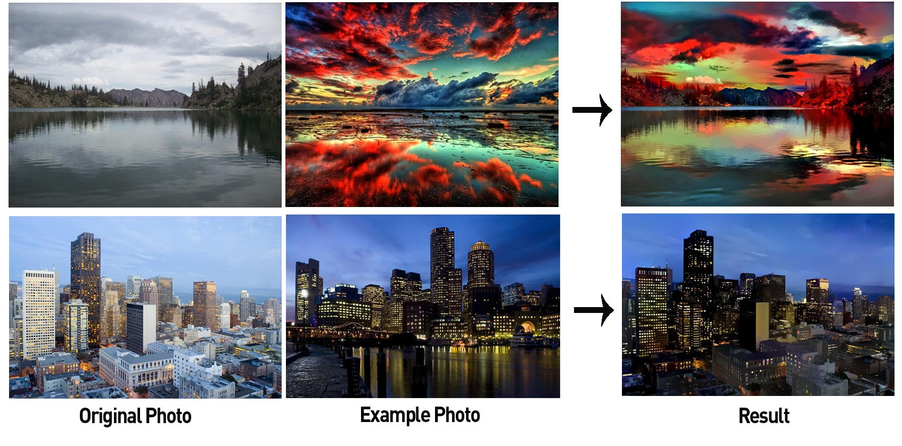
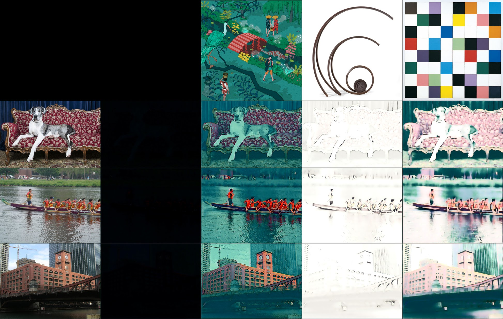
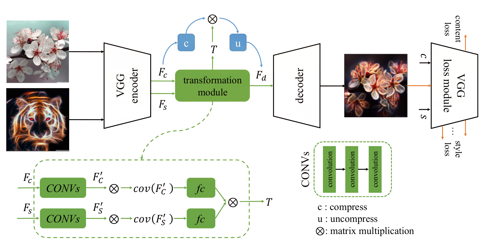
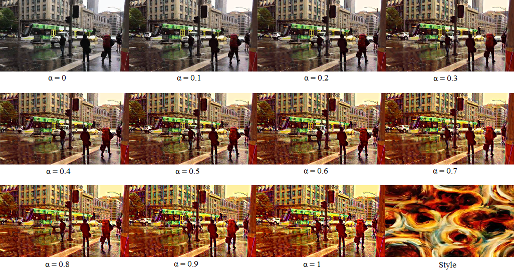
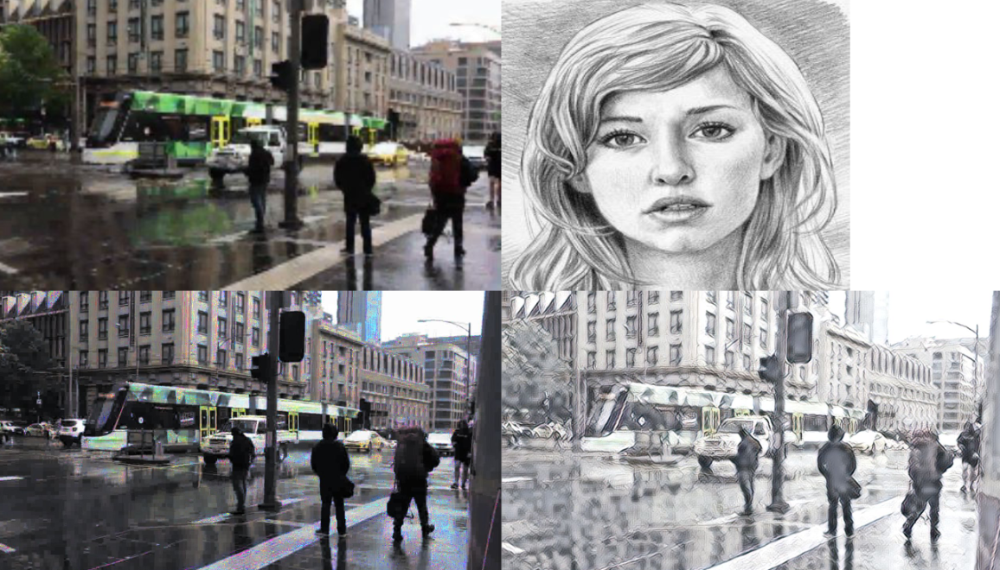

# style-transfer-server

This repository is part of a bachelor thesis available at: https://github.com/bbbrtk/bachelor-thesis.
It contains real-time style transfer neural networks fit to use in production.
Networks have been pruned and converted to TensorRT format to increase their speed.
File [server_transfrom_example.py](https://github.com/kamieen03/style-transfer-server/blob/master/server_transform_example.py)
illustrates their usage.

## Style transfer
The example below illustrates the idea of style transfer. The images on the left are so-called content images, in the middle are style images.
Style transfer aims to stylize the content image using style extracted from the style image at the same time preserving structures visible in the content image.

In the mosaic below 2nd, 3rd and 4th rows correspond to particular content images, while columns - starting with the 2dn one - to styles.
The second column serves as a sanity check - the style image is completely black, so we expect stylized images to also be this way. The network passes this test.

## Network architecture
Used networks are based on [Learning Linear Transformations for Fast Arbitrary Style Transfer](https://arxiv.org/abs/1808.04537) by Li et al.
The architecture consists of three subnetworks:
- Encoder encodes both content and style images to latent space
- Transformation module then uses style features Fs to stylize content features Fc
- Decoder then transforms the result back from latent space to image space

VGG module on the right is used only during training to compute loss functions

## Style transfer extensions
Default style transfer task can be further extended by imposing additional constraints or adding parameters. We implement two such extensions:
- In __intensity scaling__ additional parameter _a_ controls degree to which content image should be stylized. _a_ = 1 is default full stylization.
For _a_ = 0, the content image shouldn't be stylized at all - the picture should remain unchanged. The picture below illustrates the effect
of stylization for _a_ changing in the range from 0 to 1 with step 0.1.

- Another possible extension is __color preservation__. This parameter is binary and controls whether colors from the content image should be preserved or not.
By default, the colors are not preserved. The image below shows transformation with (bottom left) and without preservation (bottom right).
As we see, preservation is only partial.

